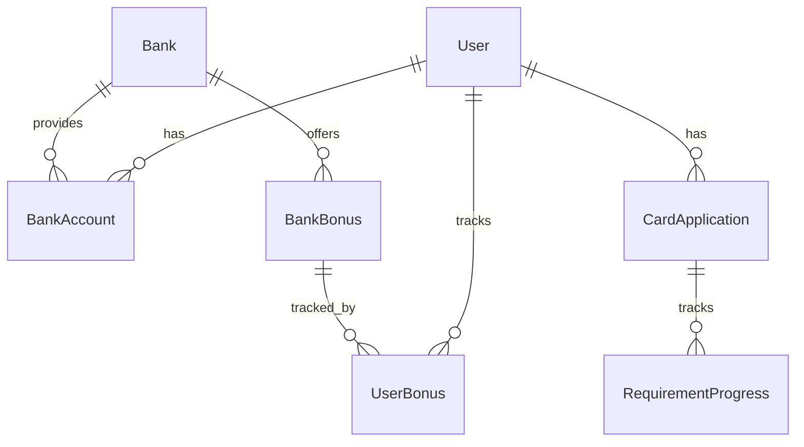
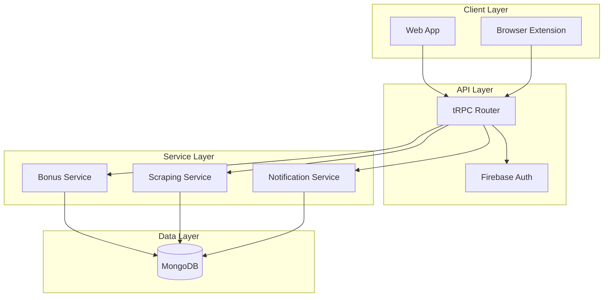
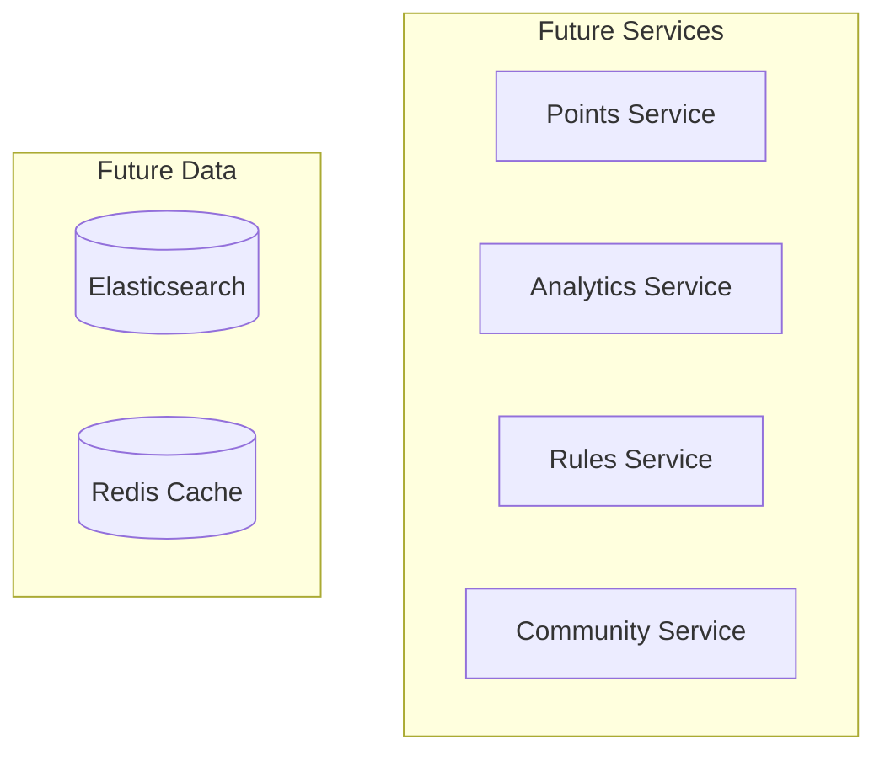
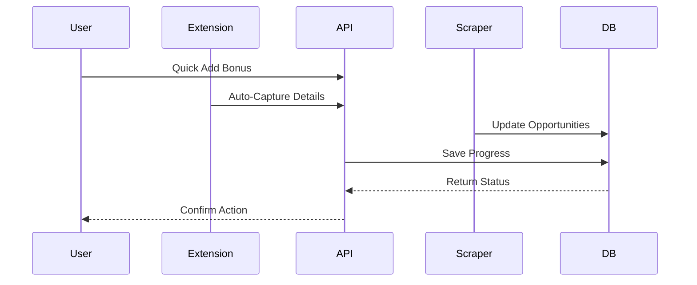
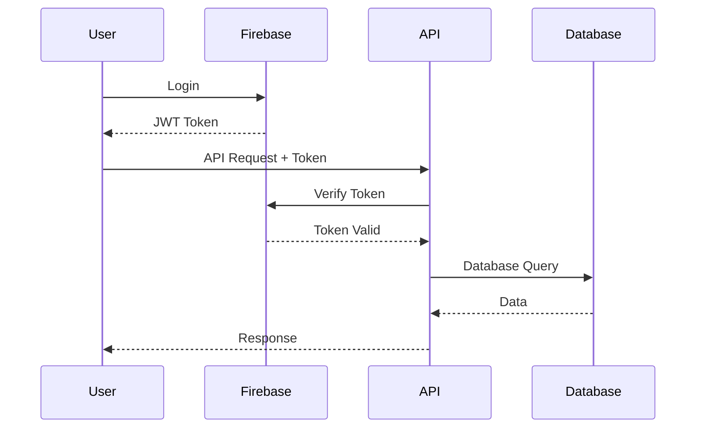

# System Architecture

## Overview

Churnistic's architecture is designed for speed of development and minimal user input, with a focus on automated bank bonus and credit card tracking. The system is built to be easily extensible for future features.

## Core Components

### MVP Data Model

### System Components (MVP)

### Future Components

## Key Services (MVP)

### Bonus Service
- Quick bonus tracking
- Automated requirement monitoring
- Progress calculations
- Smart recommendations

### Scraping Service
- DoC daily scraping
- Reddit monitoring
- Data categorization
- Update detection

### Notification Service
- Email notifications
- Browser notifications
- Deadline reminders
- Success tracking

## Data Flow (MVP)

## Security Architecture

### Authentication (MVP)

## MVP Infrastructure

### Frontend
- Next.js for fast development
- Tailwind for quick styling
- shadcn/ui for ready components
- Browser extension for automation

### Backend
- tRPC for type-safe APIs
- Prisma for database access
- MongoDB for flexible schema
- Firebase for auth

### Deployment
- Vercel for frontend
- MongoDB Atlas for database
- Firebase for authentication

## Future Scalability

### Service Expansion
- Points tracking service
- Advanced analytics
- Community features
- Enterprise capabilities

### Data Enhancement
- Search optimization
- Caching layer
- Real-time updates
- Data warehousing

### Infrastructure Growth
- Microservices architecture
- Container orchestration
- Global distribution
- Advanced monitoring

## Development Workflow (MVP)

### Local Setup
- Simple Docker setup
- Development database
- Basic test data
- Hot reloading

### Deployment Pipeline
- GitHub integration
- Automated testing
- Vercel deployment
- Database migrations

## Monitoring (MVP)

### Essential Metrics
- API response times
- Scraping success rates
- User activation
- Error tracking

### Future Metrics
- Advanced analytics
- Performance profiling
- User engagement
- Business metrics
