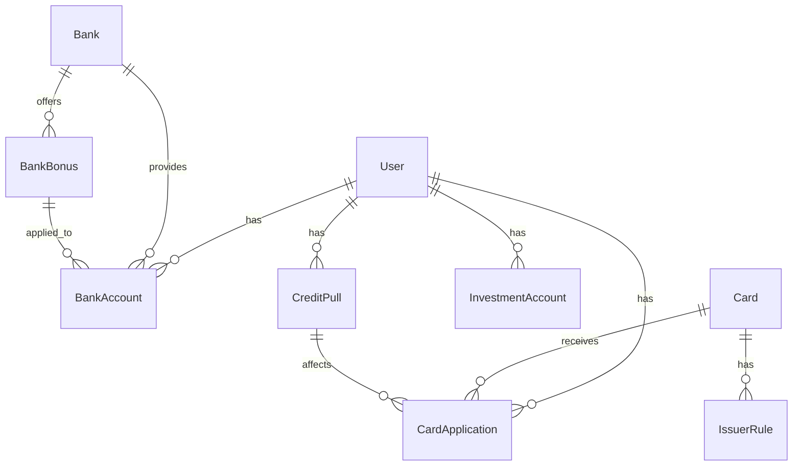
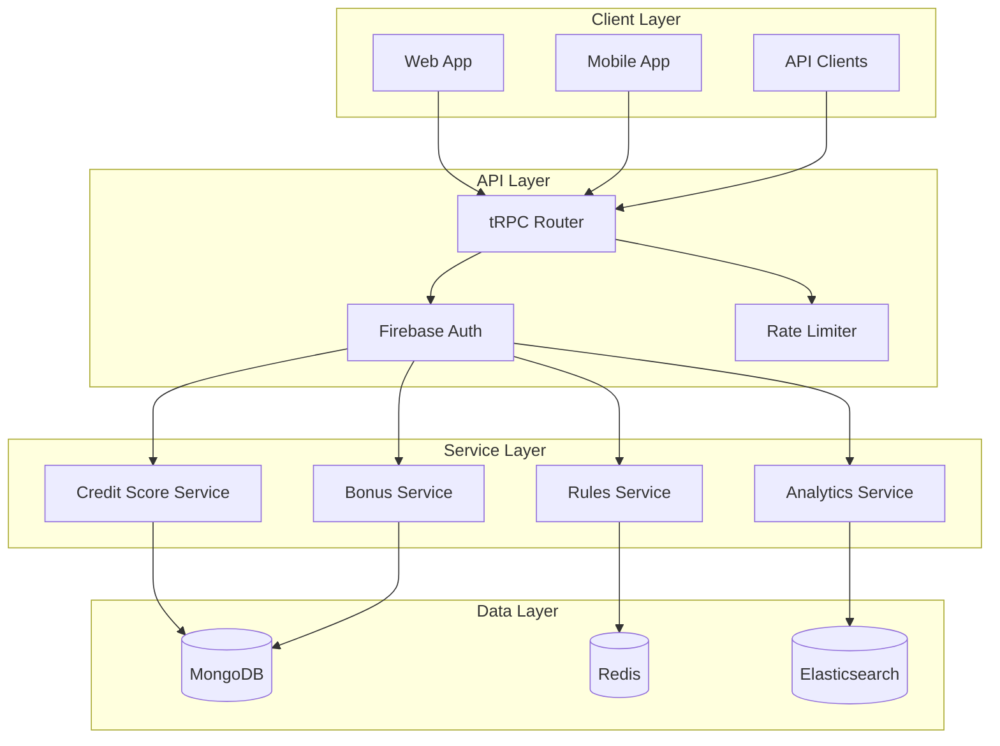
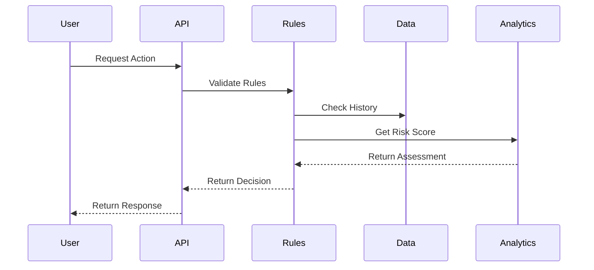
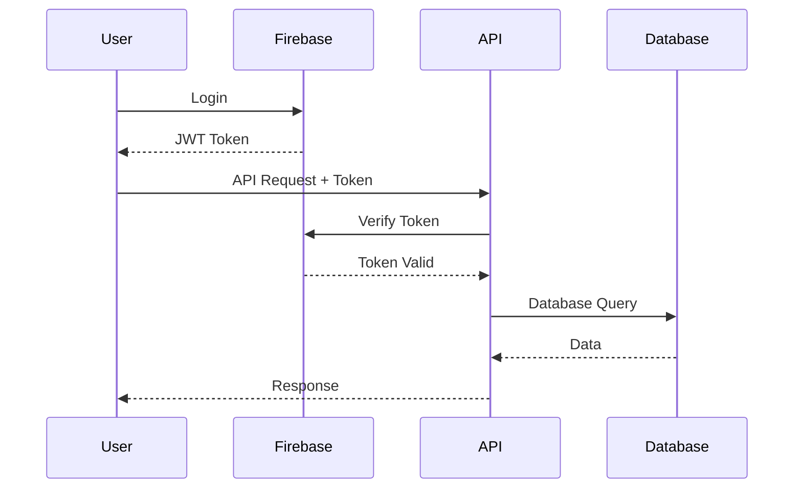

# System Architecture

## Overview

Churnistic's architecture is designed to handle complex credit card churning rules, bank bonus tracking, and investment opportunity optimization while ensuring data security and real-time updates.

## Core Components

### Data Model

### System Components

## Key Services

### Credit Card Service
- Application tracking
- Rule validation
- Velocity checking
- Bonus tracking
- Credit score impact analysis

### Bank Bonus Service
- Opportunity tracking
- Requirements validation
- ChexSystems monitoring
- Direct deposit tracking
- Early termination monitoring

### Investment Bonus Service
- Opportunity tracking
- Deposit requirement monitoring
- Holding period tracking
- Transfer optimization
- Bonus stacking analysis

### Analytics Service
- Success rate calculation
- Risk assessment
- Return on investment analysis
- Historical trend analysis
- Recommendation engine

## Data Flow

## Security Architecture

### Authentication Flow

## Scalability

### Horizontal Scaling
- Service replication
- Database sharding
- Cache distribution
- Load balancing

### Vertical Scaling
- Resource optimization
- Query optimization
- Cache optimization
- Background processing

## Data Security

### Encryption
- Data at rest encryption
- Data in transit encryption
- Sensitive data masking
- Token-based authentication

### Compliance
- GDPR compliance
- CCPA compliance
- PCI DSS guidelines
- Data retention policies

## Monitoring

### System Metrics
- API response times
- Database performance
- Cache hit rates
- Error rates

### Business Metrics
- Active users
- Bonus success rates
- Risk scores
- User engagement

## Disaster Recovery

### Backup Strategy
- Database backups
- Configuration backups
- User data backups
- System state backups

### Recovery Process
- Automated failover
- Data restoration
- Service recovery
- State verification

## Development Environment

### Local Setup
- Docker containers
- Development database
- Mock services
- Test data

### CI/CD Pipeline
- Automated testing
- Code quality checks
- Security scanning
- Deployment automation