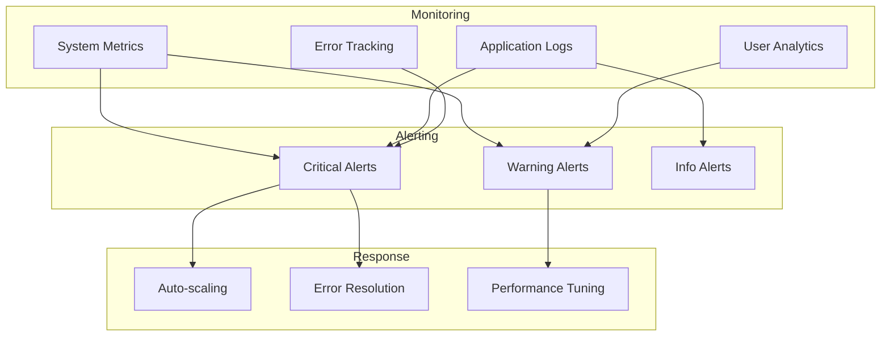

# Deployment Strategy

## Overview

Churnistic follows a robust deployment strategy ensuring reliability, security, and continuous delivery.

### Deployment Pipeline

## Environment Strategy

### 1. Development

- Local development setup
- Feature branch deployments
- Integration testing
- Performance profiling

### 2. Staging

- Production-like environment
- Full integration testing
- Load testing
- User acceptance testing

### 3. Production

- Blue-green deployment
- Canary releases
- Auto-scaling
- High availability

## Infrastructure Management

### Cloud Architecture

### Infrastructure as Code

- Terraform configurations
- AWS CloudFormation
- Docker containers
- Kubernetes orchestration

## Release Process

### Release Flow

### 1. Preparation

- Version tagging
- Change documentation
- Dependency updates
- Security checks

### 2. Deployment

- Zero-downtime updates
- Database migrations
- Cache warming
- Health checks

### 3. Verification

- Smoke tests
- Integration checks
- Performance monitoring
- User feedback

## Monitoring & Alerts

### System Health

### 1. Metrics

- System performance
- Application health
- User experience
- Business metrics

### 2. Alerts

- Critical incidents
- Performance issues
- Security events
- Business thresholds

### 3. Response

- Automated recovery
- Manual intervention
- Incident documentation
- Post-mortem analysis

## Security Measures

### 1. Access Control

- Role-based access
- Multi-factor authentication
- Audit logging
- Session management

### 2. Data Protection

- Encryption in transit
- Encryption at rest
- Key management
- Data backups

### 3. Compliance

- Security scanning
- Vulnerability assessment
- Compliance audits
- Policy enforcement

## Disaster Recovery

### 1. Backup Strategy

- Automated backups
- Point-in-time recovery
- Cross-region replication
- Backup verification

### 2. Recovery Plan

- RTO/RPO objectives
- Recovery procedures
- Team responsibilities
- Communication plan

### 3. Business Continuity

- Failover systems
- Data redundancy
- Service resilience
- Incident response
