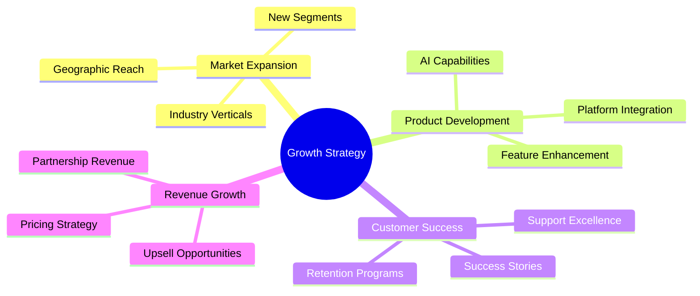
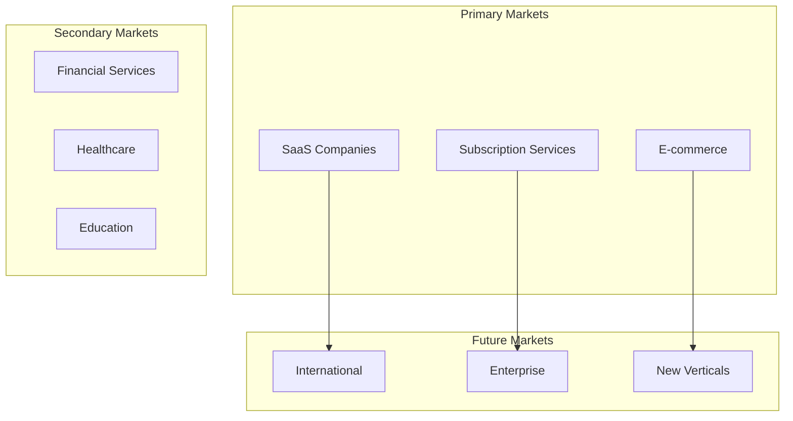
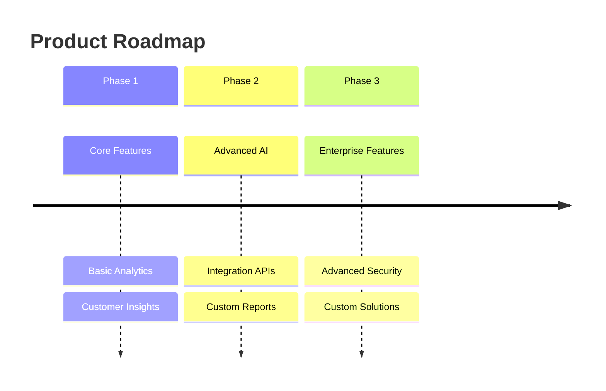
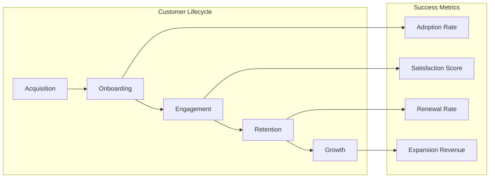
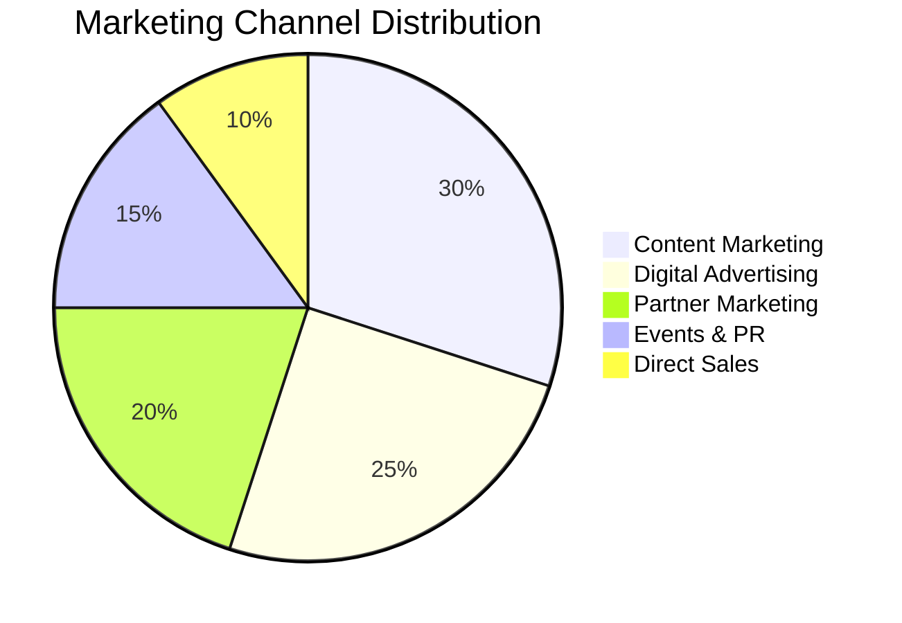
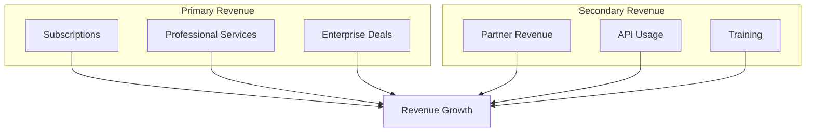

# Growth Strategy

## Overview

Churnistic's growth strategy focuses on sustainable expansion, market penetration, and continuous value delivery.

### Growth Framework

## Market Strategy

### Target Markets

### 1. Market Penetration
- Industry focus
- Geographic expansion
- Market share growth
- Competitive positioning

### 2. Customer Segments
- Ideal customer profiles
- Segment prioritization
- Value propositions
- Acquisition strategy

### 3. Partnership Strategy
- Strategic alliances
- Channel partners
- Technology partners
- Integration partners

## Product Growth

### Feature Evolution

### 1. Product Development
- Feature prioritization
- User feedback loop
- Innovation pipeline
- Technical roadmap

### 2. Platform Expansion
- API ecosystem
- Integration capabilities
- Custom solutions
- Enterprise features

### 3. Technology Innovation
- AI advancement
- Predictive analytics
- Automation features
- Performance optimization

## Customer Success

### Success Journey

### 1. Customer Experience
- Onboarding process
- Success metrics
- Support excellence
- Feedback loops

### 2. Retention Strategy
- Value demonstration
- Engagement programs
- Success stories
- Community building

### 3. Growth Programs
- Account expansion
- Referral systems
- Loyalty rewards
- Customer advocacy

## Marketing Strategy

### Channel Strategy

### 1. Content Marketing
- Thought leadership
- Success stories
- Educational content
- Industry insights

### 2. Digital Presence
- SEO optimization
- Social media
- Email campaigns
- Online advertising

### 3. Brand Building
- Brand identity
- Market positioning
- Community engagement
- Industry presence

## Revenue Growth

### Revenue Streams

### 1. Pricing Strategy
- Value-based pricing
- Package optimization
- Upsell opportunities
- Revenue optimization

### 2. Financial Growth
- Revenue targets
- Cost optimization
- Profit margins
- Investment strategy

### 3. Business Development
- Market opportunities
- Strategic partnerships
- New revenue streams
- Business models

## Performance Metrics

### 1. Growth Metrics
- Customer acquisition
- Revenue growth
- Market penetration
- Customer lifetime value

### 2. Success Indicators
- Customer satisfaction
- Product adoption
- Feature usage
- Support efficiency

### 3. Business Health
- Financial metrics
- Operational efficiency
- Team performance
- Market position