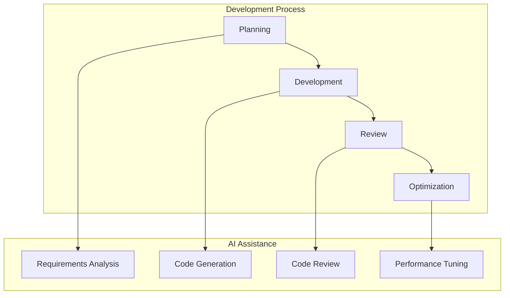
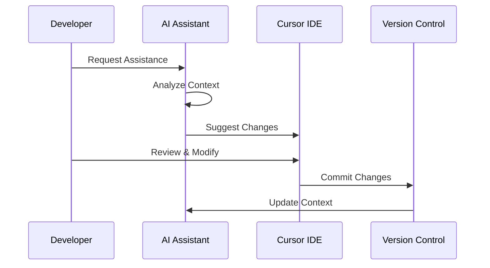
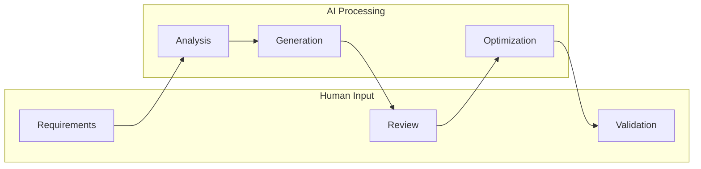
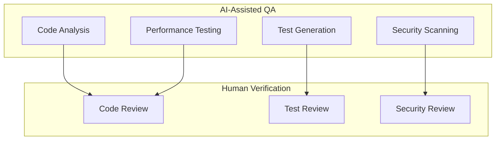

# AI Collaboration Strategy

## Overview

Churnistic's AI-first approach integrates artificial intelligence throughout the development lifecycle, enhancing productivity and innovation.

### AI Integration Flow

## AI Development Workflow

### 1. Planning Phase

- Requirements analysis
- Architecture design
- Task breakdown
- Risk assessment

### 2. Development Phase

- Code generation
- Documentation
- Testing
- Optimization

### 3. Review Phase

- Code review
- Performance analysis
- Security checks
- Best practices

## AI Tools Integration

### Tool Workflow

### 1. Development Tools

- Cursor IDE
- AI code completion
- Intelligent refactoring
- Automated testing

### 2. Review Tools

- Code analysis
- Performance profiling
- Security scanning
- Quality checks

### 3. Documentation Tools

- Auto-documentation
- API documentation
- Comment generation
- Markdown assistance

## Best Practices

### AI Collaboration Flow

### 1. Communication

- Clear prompts
- Context sharing
- Feedback loops
- Iteration cycles

### 2. Code Quality

- Style consistency
- Documentation standards
- Testing requirements
- Performance goals

### 3. Security

- Code review
- Vulnerability checks
- Dependency scanning
- Access control

## AI Capabilities

### 1. Code Generation

- Component creation
- API endpoints
- Test cases
- Documentation

### 2. Code Analysis

- Performance optimization
- Security analysis
- Quality checks
- Best practices

### 3. Development Support

- Error resolution
- Refactoring
- Debugging
- Documentation

## Training & Guidelines

### 1. Team Training

- AI tool usage
- Best practices
- Prompt engineering
- Workflow integration

### 2. Documentation

- Usage guidelines
- Best practices
- Common patterns
- Troubleshooting

### 3. Support

- Technical assistance
- Knowledge sharing
- Updates & improvements
- Team collaboration

## Quality Assurance

### QA Process

### 1. Code Quality

- Automated analysis
- Style checking
- Performance metrics
- Security scanning

### 2. Testing

- Test generation
- Coverage analysis
- Performance testing
- Integration testing

### 3. Monitoring

- Quality metrics
- Usage patterns
- Error tracking
- Performance monitoring

## Continuous Improvement

### 1. Process Optimization

- Workflow refinement
- Tool integration
- Best practices
- Team feedback

### 2. Knowledge Base

- Common solutions
- Best practices
- Learning resources
- Team guidelines

### 3. Innovation

- New capabilities
- Tool exploration
- Process improvement
- Team development
