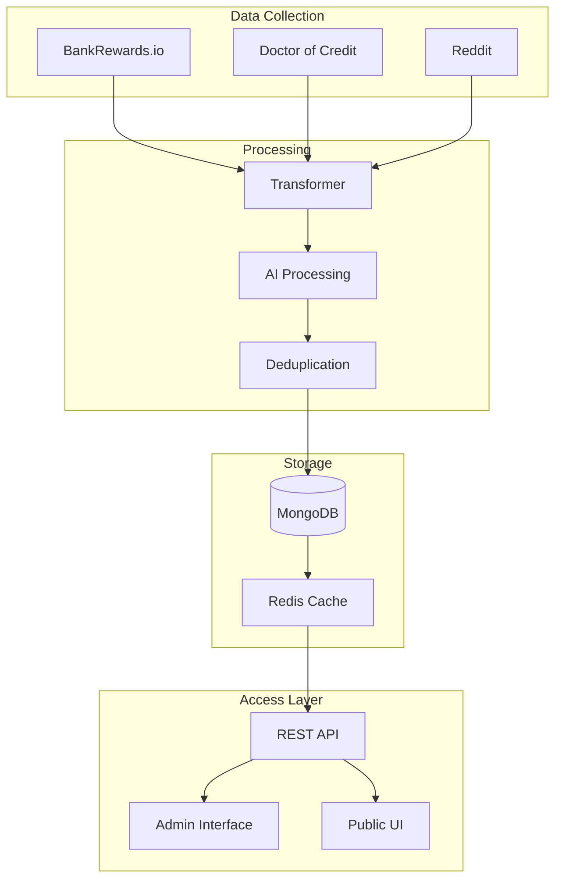

# Data Aggregation Strategy

## Architecture Overview



## Data Model

### Core Opportunity Model
```typescript
interface Opportunity {
  // Core Identity
  id: string;
  name: string;                   // Product name with ® or ™ symbols
  type: 'credit_card' | 'bank' | 'brokerage';
  bank: string;
  
  // Visual Assets
  logo?: {
    type: string;
    url: string;
  };
  card_image?: {
    url: string;
    network: 'VISA' | 'MASTERCARD' | 'AMEX' | 'DISCOVER';
    color: string;
    badge?: string;
  };
  
  // Offer Details
  value: number;                  // Normalized bonus value
  offer_link: string;
  description: string;
  status: 'active' | 'expired' | 'ending_soon';
  
  // Bonus Structure
  bonus: {
    title: string;
    description: string;
    value: number;
    tiers?: {
      reward: string;
      deposit?: string;
      requirement?: string;
    }[];
    requirements: {
      title: string;
      description: string;
      type: 'direct_deposit' | 'spend' | 'balance' | 'transactions' | 'other';
      details?: {
        amount?: number;
        period?: number;
        count?: number;
      };
    }[];
    terms?: string;
    additional_info?: string;
  };
  
  // Product Details
  details: {
    // Banking Specific
    account_type?: string;
    monthly_fees?: {
      amount: string;
      waiver_details?: string;
    };
    early_closure_fee?: string;
    chex_systems?: string;
    household_limit?: string;
    
    // Credit Card Specific
    credit_inquiry?: 'soft' | 'hard' | 'none';
    under_5_24?: 'yes' | 'no';
    annual_fees?: string;
    foreign_transaction_fees?: string;
    
    // Investment Specific
    options_trading?: string;
    ira_accounts?: string;
  };
  
  // Metadata
  metadata: {
    availability: {
      type: 'Nationwide' | 'State';
      states?: string[];
      details?: string;
    };
    source: {
      name: string;
      url: string;
      collected_at: string;
    };
    approval: {
      status: 'approved';
      reviewed_at: string;
      reviewer: string;
      confidence_score: number;
    };
    referral: {
      link: string;
      last_verified: string;
      commission?: string;
    };
    created: string;
    updated: string;
  };
  
  // Timing Information
  timing: {
    posted_date: string;
    expiration_date?: string;
    last_verified: string;
    approval_time?: string;
    bonus_posting_time?: string;
  };
  
  disclosure?: string;
}
```

### Admin Extension
```typescript
interface AdminOpportunity extends Opportunity {
  processing_status: {
    source_validation: boolean;
    ai_processed: boolean;
    duplicate_checked: boolean;
    needs_review: boolean;
  };
  ai_insights: {
    confidence_score: number;
    potential_duplicates: string[];
    validation_warnings: string[];
    suggested_edits: {
      field: string;
      current: string;
      suggested: string;
      reason: string;
    }[];
  };
}
```

## Implementation Roadmap

### Phase 1: Core Infrastructure (Current)
- ✅ BankRewards.io integration
- ✅ Basic data transformation
- ✅ MongoDB storage
- ✅ Public UI

### Phase 2: Enhanced Data Collection (In Progress)
- 🔄 Doctor of Credit integration
- 🔄 AI-powered parsing
- 🔄 Admin interface MVP

### Phase 3: Intelligence Layer (Next)
- ⏳ Deduplication system
- ⏳ Reddit integration
- ⏳ Enhanced validation rules

### Phase 4: Advanced Features
- ⭕ Real-time updates
- ⭕ Automated verification
- ⭕ User personalization
- ⭕ Advanced analytics

## Data Flow

1. **Collection**
   - Automated scrapers run on schedule
   - Raw data collected from sources
   - Initial validation checks

2. **Processing**
   - Data normalization
   - AI-powered parsing
   - Deduplication checks
   - Confidence scoring

3. **Verification**
   - Admin review queue
   - Automated verification
   - Manual override options

4. **Distribution**
   - REST API endpoints
   - Redis caching layer
   - Real-time updates
   - Analytics aggregation

## Quality Assurance

1. **Data Validation**
   - Schema validation
   - Business rule enforcement
   - Cross-reference checking

2. **Monitoring**
   - Real-time error tracking
   - Source reliability metrics
   - Processing pipeline health

3. **Maintenance**
   - Daily data freshness checks
   - Weekly source validation
   - Monthly data cleanup 