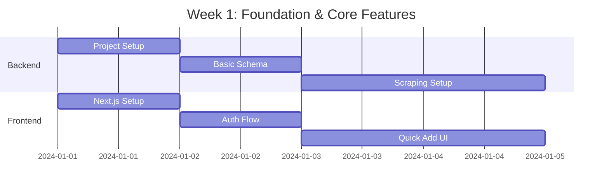
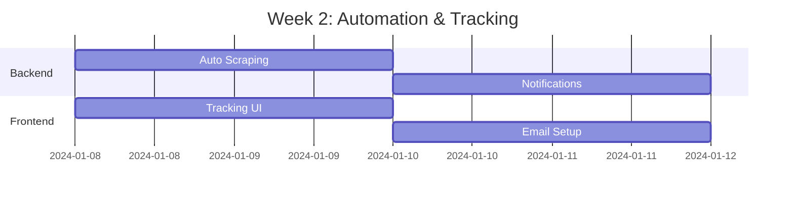
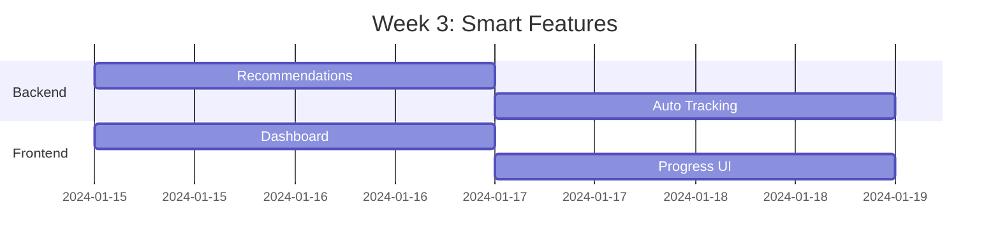

# Churnistic MVP Development Plan

## Core Principles

1. Speed of Development

   - Focus on essential features first
   - Leverage existing APIs and services
   - Use proven, stable tech stack
   - Rapid iterations with user feedback

2. Minimal User Input
   - Automated data collection where possible
   - Smart defaults based on location
   - One-click actions for common tasks
   - Intelligent form prefilling

## MVP Features (Prioritized)

1. Essential Tracking

   - Bank bonus database (automated scraping)
     - DoC daily scraping
     - Reddit r/churning thread monitoring
     - Automatic categorization
   - Quick-add interface
     - One-click application tracking
     - Smart date suggestions
     - Auto-populated requirements

2. Automated Monitoring

   - Email notifications
     - New bonus alerts
     - Requirement deadlines
     - Success confirmations
   - Browser extension
     - Auto-capture application details
     - Quick bonus tracking
     - Requirement completion

3. Smart Assistant

   - Personalized recommendations
     - Location-based filtering
     - Bank relationship aware
     - Cool-down period tracking
   - Automated requirement tracking
     - Bank statement analysis
     - Transaction categorization
     - Progress calculations

4. Basic Points Integration
   - Manual balance tracking
   - Simple redemption suggestions
   - Major program support only
   - Basic transfer partner info

## Future Features (Post-MVP)

1. Advanced Points & Travel

   - AI trip planning
   - Award space monitoring
   - Dynamic valuations
   - Complex routing

2. Community Features

   - Success stories
   - Data points
   - Method sharing
   - Trip reports

3. Advanced Analytics
   - ROI calculations
   - Time investment analysis
   - Risk assessment
   - Pattern recognition

## Data Models

### Core Models (MVP)

```typescript
interface User {
  id: string;
  firebaseUid: string;
  email: string;
  profile: {
    location: {
      state: string;
      nearbyStates: string[];
    };
    preferences: {
      emailNotifications: boolean;
      pushNotifications: boolean;
      riskTolerance: 'low' | 'medium' | 'high';
    };
  };
}

interface BankBonus {
  id: string;
  bankId: string;
  title: string;
  amount: number;
  type: 'checking' | 'savings' | 'business' | 'credit_card';
  requirements: {
    directDeposit?: {
      amount: number;
      frequency: 'one-time' | 'monthly';
      period: number;
    };
    balance?: {
      amount: number;
      duration: number;
    };
    transactions?: {
      count: number;
      type: string;
      period: number;
    };
  };
  restrictions: {
    states: string[];
    expiration?: Date;
    mustBeNew: boolean;
    newPeriod?: number;
  };
  source: {
    url: string;
    dateFound: Date;
    lastVerified: Date;
  };
}

interface UserBonus {
  id: string;
  userId: string;
  bonusId: string;
  status: 'planned' | 'in_progress' | 'completed';
  startDate: Date;
  targetDate: Date;
  autoTracking: {
    enabled: boolean;
    emailForwards?: string[];
    statementSync?: boolean;
  };
  progress: {
    requirements: Record<
      string,
      {
        completed: boolean;
        value: number;
        lastChecked: Date;
      }
    >;
    nextDeadline?: Date;
    estimatedCompletion?: Date;
  };
}
```

### Future Models (Post-MVP)

```typescript
// Points tracking, travel goals, and community features
// will be added post-MVP
```

## Sprint Plan

### Week 1: Foundation & Core Features



### Week 2: Automation & Tracking



### Week 3: Smart Features



### Week 4: Polish & Launch


## Technical Stack

### Frontend (Minimal Setup)

- Next.js 14
- TypeScript
- Tailwind CSS
- shadcn/ui components

### Backend (Essential Only)

- tRPC
- Prisma
- MongoDB
- Firebase Auth
- Cheerio (scraping)

### Infrastructure

- Vercel
- MongoDB Atlas
- Firebase
