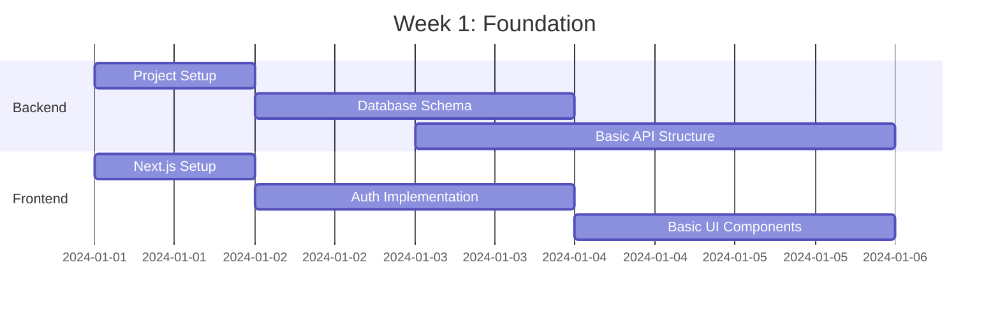
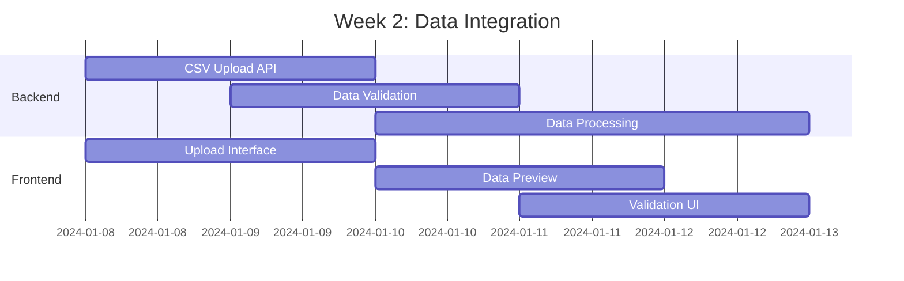
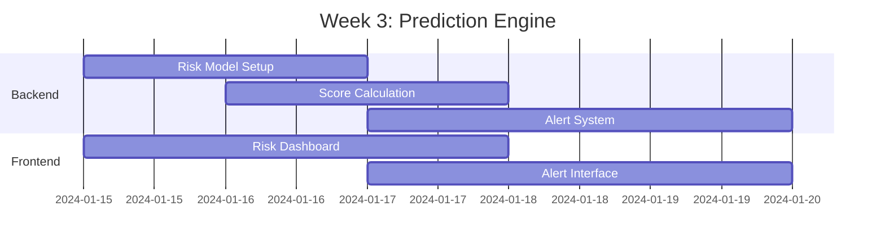
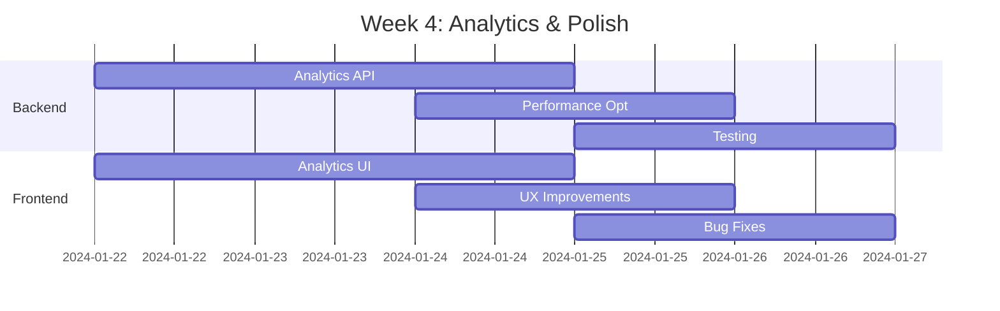
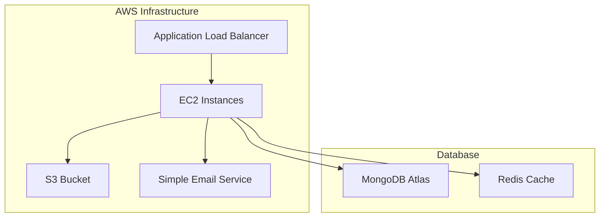
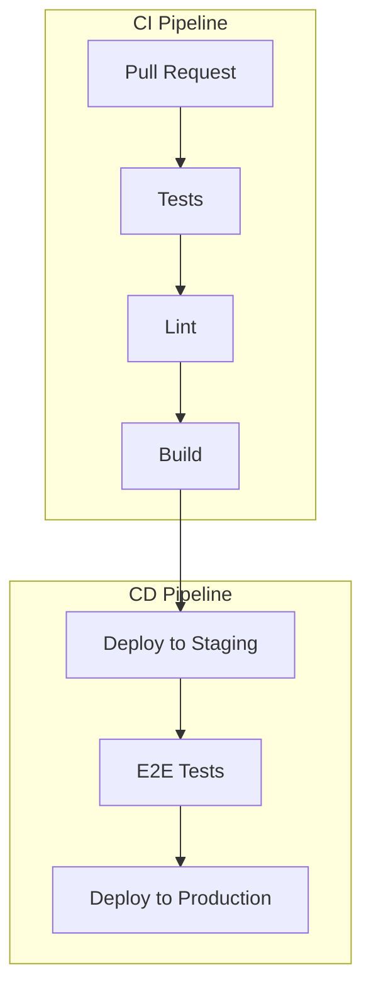

# Churnistic MVP Development Plan

## MVP Scope (4 Weeks)

### Core Features

1. Customer Data Integration

   - CSV upload for historical customer data
   - Basic data validation and cleaning
   - Customer profile creation

2. Churn Prediction Engine

   - Basic ML model for churn prediction
   - Key indicators monitoring
   - Risk score calculation

3. Dashboard & Analytics

   - Customer risk overview
   - Churn metrics visualization
   - Basic filtering and sorting

4. Alert System
   - High-risk customer notifications
   - Email alerts for stakeholders
   - Basic alert configuration

## Data Models

### Customer

```typescript
interface Customer {
  id: string;
  email: string;
  company: string;
  industry: string;
  subscriptionTier: 'basic' | 'pro' | 'enterprise';
  subscriptionStart: Date;
  lastBillingDate: Date;
  monthlyRevenue: number;
  status: 'active' | 'churned' | 'at_risk';
  createdAt: Date;
  updatedAt: Date;
}
```

### Activity

```typescript
interface Activity {
  id: string;
  customerId: string;
  type: 'login' | 'feature_use' | 'support_ticket' | 'billing_issue';
  timestamp: Date;
  metadata: {
    feature?: string;
    duration?: number;
    severity?: 'low' | 'medium' | 'high';
    resolution?: string;
  };
}
```

### ChurnRisk

```typescript
interface ChurnRisk {
  id: string;
  customerId: string;
  score: number; // 0-100
  indicators: {
    activityDecline?: boolean;
    billingIssues?: boolean;
    supportTickets?: boolean;
    featureAdoption?: boolean;
  };
  trend: 'improving' | 'stable' | 'declining';
  lastUpdated: Date;
}
```

### Alert

```typescript
interface Alert {
  id: string;
  customerId: string;
  type: 'high_risk' | 'declining_usage' | 'billing_warning';
  severity: 'low' | 'medium' | 'high';
  status: 'new' | 'acknowledged' | 'resolved';
  createdAt: Date;
  resolvedAt?: Date;
}
```

## Sprint Plan

### Week 1: Foundation



#### Key PRs:

1. `feat: Initial project setup (#1)`

   - Next.js + TypeScript setup
   - MongoDB connection
   - Basic API structure

2. `feat: Authentication system (#2)`

   - User registration/login
   - JWT implementation
   - Protected routes

3. `feat: Core data models (#3)`
   - Customer schema
   - Activity tracking
   - Risk assessment

### Week 2: Data Integration



#### Key PRs:

1. `feat: CSV upload system (#4)`

   - File upload component
   - Data validation
   - Error handling

2. `feat: Customer data processing (#5)`

   - Data transformation
   - Profile creation
   - Activity logging

3. `feat: Data validation UI (#6)`
   - Preview interface
   - Error reporting
   - Success confirmation

### Week 3: Prediction Engine



#### Key PRs:

1. `feat: Churn prediction model (#7)`

   - Risk scoring algorithm
   - Indicator analysis
   - Trend calculation

2. `feat: Risk dashboard (#8)`

   - Risk visualization
   - Customer filtering
   - Trend analysis

3. `feat: Alert system (#9)`
   - Alert generation
   - Email notifications
   - Alert management UI

### Week 4: Analytics & Polish



#### Key PRs:

1. `feat: Analytics dashboard (#10)`

   - Metrics visualization
   - Export functionality
   - Custom reports

2. `feat: Performance optimization (#11)`

   - Query optimization
   - Caching implementation
   - Load testing

3. `feat: Final polish (#12)`
   - Bug fixes
   - UI improvements
   - Documentation

## Technical Stack

### Frontend

- Next.js 14
- TypeScript
- Tailwind CSS
- shadcn/ui components
- React Query
- Recharts

### Backend

- Node.js
- Express
- MongoDB
- Redis (caching)
- JWT authentication

### DevOps

- GitHub Actions
- Docker
- AWS (EC2, S3, SES)
- MongoDB Atlas

## API Endpoints

### Customer Management

```typescript
// POST /api/customers/upload
// Upload customer data CSV
interface UploadResponse {
  processed: number;
  failed: number;
  errors?: string[];
}

// GET /api/customers
// List customers with filters
interface CustomerListParams {
  status?: 'active' | 'churned' | 'at_risk';
  riskScore?: number;
  page?: number;
  limit?: number;
}

// GET /api/customers/:id/risk
// Get customer risk details
interface RiskDetails {
  score: number;
  indicators: string[];
  recommendations: string[];
  history: {
    date: Date;
    score: number;
  }[];
}
```

### Analytics

```typescript
// GET /api/analytics/overview
interface AnalyticsOverview {
  totalCustomers: number;
  atRiskCount: number;
  churnRate: number;
  revenueAtRisk: number;
}

// GET /api/analytics/trends
interface ChurnTrends {
  daily: {
    date: Date;
    churnCount: number;
    newCustomers: number;
  }[];
  riskDistribution: {
    low: number;
    medium: number;
    high: number;
  };
}
```

## Deployment

### Infrastructure Setup



### CI/CD Pipeline



## Launch Checklist

### Pre-launch

- [ ] Security audit
- [ ] Performance testing
- [ ] Data backup system
- [ ] Monitoring setup
- [ ] Documentation
- [ ] User guides

### Launch Day

- [ ] Database migration
- [ ] DNS configuration
- [ ] SSL certificates
- [ ] Initial deployment
- [ ] Smoke testing
- [ ] Team communication

### Post-launch

- [ ] Monitor metrics
- [ ] Gather feedback
- [ ] Address issues
- [ ] Plan iterations
