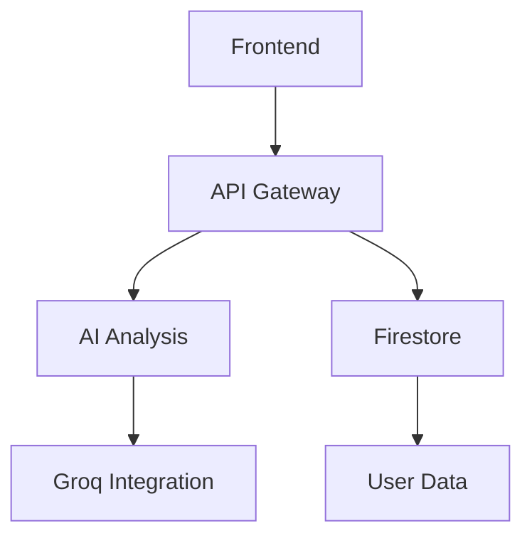

# Churnistic Collaboration Framework

<!-- Version Control Metadata -->
<!-- Version: 1.1.0 -->
<!-- Last Updated: 2025-01-18 -->
<!-- Contributors: [Add Names] -->

## Table of Contents

- [Churnistic Collaboration Framework](#churnistic-collaboration-framework)
  - [Table of Contents](#table-of-contents)
  - [Project Overview](#project-overview)
  - [Feature Requirements](#feature-requirements)
    - [Core Features](#core-features)
    - [Technical Requirements](#technical-requirements)
  - [Implementation Strategy](#implementation-strategy)
    - [Architecture Overview](#architecture-overview)
    - [Key Components](#key-components)
  - [Quality Assurance](#quality-assurance)
    - [Testing Matrix](#testing-matrix)
    - [Test Case Examples](#test-case-examples)
  - [Documentation Standards](#documentation-standards)
    - [Required Documentation](#required-documentation)
    - [Documentation Best Practices](#documentation-best-practices)
  - [Version History](#version-history)

## Project Overview

**Churnistic Credit Card Optimization Platform**

**Core Objectives:**

- Maximize credit card rewards
- Streamline opportunity tracking
- Provide AI-driven insights
- Ensure secure financial management

**Brand Guidelines:**

- Primary Color: #007bff (Churnistic Blue)
- Secondary Color: #6c757d (Graphite Gray)
- Typography: Inter, sans-serif
- Icon Set: Material Icons

## Feature Requirements

### Core Features

- [ ] Opportunity Discovery
- [ ] Reward Tracking
- [ ] AI Analysis
- [ ] Security Framework

### Technical Requirements

- [ ] Real-time Data Sync
- [ ] Role-based Access
- [ ] API Rate Limiting
- [ ] Error Recovery

## Implementation Strategy

### Architecture Overview



### Key Components

1. **Opportunity Manager**

   - Responsibility: CRUD operations for opportunities
   - Dependencies: Firestore, React Query
   - Configuration: API endpoints, caching rules

2. **AI Analyzer**
   - Responsibility: Process opportunities with Groq
   - Dependencies: Groq SDK, Firebase Functions
   - Configuration: API keys, rate limits

## Quality Assurance

### Testing Matrix

| Test Type   | Coverage Target | Tools                 |
| ----------- | --------------- | --------------------- |
| Unit Tests  | 90%             | Jest                  |
| Integration | 85%             | React Testing Library |
| E2E         | 80%             | Cypress               |
| Security    | 100%            | OWASP ZAP             |

### Test Case Examples

```markdown
| ID     | Description               | Expected             | Status |
| ------ | ------------------------- | -------------------- | ------ |
| TC-101 | Add new opportunity       | Success message      | ✅     |
| TC-102 | Edit existing opportunity | Updated data         | ✅     |
| TC-103 | Delete opportunity        | Removal confirmation | ✅     |
```

## Documentation Standards

### Required Documentation

- [API Specifications](#)
- [Developer Onboarding](#)
- [Security Guidelines](#)
- [Style Guide](#)

### Documentation Best Practices

- Use consistent terminology
- Include code examples
- Maintain version history
- Add visual diagrams

## Version History

| Version | Date       | Changes                    | Author      |
| ------- | ---------- | -------------------------- | ----------- |
| 1.1.0   | 2025-01-18 | Aligned with project goals | [Your Name] |
| 1.0.0   | 2025-01-18 | Initial version            | [Your Name] |

<!-- Collaboration Guidelines -->

1. Use @mentions for specific team members
2. Mark completed items with ✅
3. Use ⚠️ for critical issues
4. Follow brand style guide
5. Maintain version control
